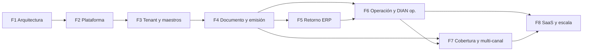

# Roadmap — API middleware SaaS multi-tenant (ERPs → canal de salida DIAN)

**Cadena B2B objetivo:** ERP del cliente → **nuestra API** (middleware SaaS multi-tenant) → **canal de salida DIAN** (vía esquema válido en Colombia, p. ej. **proveedor tecnológico autorizado por la DIAN** cuando aplique) → respuesta de la red fiscal → **persistencia** de identificadores y artefactos → **consulta** y/o **notificación saliente** hacia el ERP.

**Segmento:** PYME primero; luego mediana y grande (volumen, SLA, auditoría y compliance se endurecen).

**Stack:** La fuente de verdad del stack es **[ADR-001](./ADR/ADR-001-stack-tecnologico.md)**. Hasta su aprobación, cualquier tecnología mencionada en conversaciones o README es **hipótesis**, no compromiso.

**Neutralidad de canal:** No se asume ningún integrador comercial ni API de terceros como parte fija del diseño. La capa externa se trata como **canal de salida DIAN** / **integrador API** / **motor de emisión** según el contexto.

**Forma de aplicación:** **monolito modular** (una base de código, límites claros por carpetas o módulos). Sin microservicios en este plan.

**Forma de este documento:** el roadmap está organizado en **fases globales de construcción**, **módulos del sistema** y **maduración interna** (definir → modelar → MVP → endurecer/operar → expandir). **Los tickets de trabajo se definirán aparte** y se colgarán de estos módulos.

**Workflow y estimación:** flujo de trabajo con IA en [docs/workflow.md](./docs/workflow.md); tallas, riesgo, prueba de cierre y DoD en [docs/estimation-and-definition-of-done.md](./docs/estimation-and-definition-of-done.md). Mapa **orden de producto ↔ fases** en [docs/modules.md](./docs/modules.md).

## Resumen por fase: talla, tiempo, riesgo y prueba de cierre

Valores **tentativos** para **1 desarrollador con apoyo de IA**; refinar al planificar cada sprint. La **prueba de cierre** es a nivel fase (los issues deben acotar pruebas más pequeñas).

| Fase | Talla | Tiempo tentativo | Riesgo | Prueba de cierre (ejecutable, resumen) |
|------|-------|------------------|--------|----------------------------------------|
| **F1** | S | 2–5 días | Medio | [ADR-001](./ADR/ADR-001-stack-tecnologico.md) completo según sus criterios internos; README sin presentar stack como cerrado hasta entonces; plantilla de impacto DIAN lista. |
| **F2** | M | 1–2 semanas | Medio | Aplicación ejecutable según ADR; DB conectada; health check OK; un flujo asíncrono mínimo demostrado; CI verde con lint/tests acordados. |
| **F3** | M | 1–2 semanas | Alto | Tenant resuelto en requests; usuario consola operativo; CRUD empresa y tercero; **evidencia de aislamiento** entre tenants. |
| **F4** | L | 3–6 semanas | Alto | E2E en **sandbox** del primer **canal de salida**: camino feliz + al menos un rechazo; identificadores/artefactos persistidos según ADR; callback entrante del canal si aplica. |
| **F5** | M | 1–2 semanas | Medio | Consulta de estado estable para integrador; **webhook saliente** con reintentos y **registro de entregas**; o cliente de prueba documentado que valide el contrato. |
| **F6** | L | 2–4 semanas | Medio | DLQ + **replay manual** operativo; panel interno mínimo; logging estructurado con correlación; **suite de regresión normativa** iniciada (casos reproducibles). |
| **F7** | L–XL | 4–10 semanas | Alto | Nuevo tipo documental **o** segundo canal con trazabilidad de intentos; regresión ampliada sin romper F4–F6. |
| **F8** | M | 2–6 semanas | Medio | Planes y contadores coherentes con uso real; pasarela de cobro en entorno de prueba **o** documentación explícita si se pospone; OpenAPI publicado para integradores. |

**Regla:** fase **L** o **XL** → partir en issues enlazados antes de abordarla en un solo bloque.

---

## Módulo transversal: Cumplimiento y adaptación DIAN

**Objetivo:** absorber cambios normativos, técnicos y operativos de la DIAN y del ecosistema fiscal **sin reescribir el producto entero**.

**Por qué es transversal:** el riesgo no es puntual; vuelve en cada ampliación de tipos documentales, cada cambio de validación y cada nuevo **canal de salida**.

**Maduración sugerida (progresiva):**

| Momento | Enfoque |
|---------|---------|
| Desde F1 | Marco explícito: qué versiona el producto (payloads, tipos, reglas), cómo se documenta el impacto y qué es “compatibilidad” frente al canal |
| F4 | MVP de gobierno: checklist de impacto por cambio, pruebas críticas mínimas alrededor del primer flujo de emisión |
| F6 | Endurecimiento: **parametrización regulatoria** donde aplique, **suite de regresión normativa** ampliable, proceso de **análisis de impacto** ante actualizaciones |
| F7 | Expansión: misma lógica aplicada a nuevos tipos documentales y a un **segundo canal** o **estrategia de emisión** alternativa |

**Capacidades que el roadmap asume como deseables (sin detallar implementación aquí):** monitoreo de fuentes normativas/técnicas relevantes; análisis de impacto; versionado documental y de contratos; parametrización de reglas; regresión automatizada o semi-automatizada; **contingencia** (degradación controlada, comunicación a clientes, rollback de reglas) cuando el cambio sea abrupto.

Este módulo **no sustituye** al **motor de emisión** ni a los **adaptadores de canal**; los **alinea** para que el cambio sea gobernado.

---

## F1 — Decisiones y arquitectura

**Objetivo:** cerrar decisiones base y límites del sistema antes de acumular implementación irreversible.

**Qué habilita:** elección coherente de persistencia, async, almacén de artefactos, observabilidad mínima y **patrón interno API ↔ adaptador de canal de salida**.

**Por qué va primero:** sin ello, cada módulo posterior elige tecnología a ciegas y se multiplica el retrabajo.

### Módulo: Arquitectura y ADR

- **Definir:** alcance del monolito modular; fronteras entre dominio propio, **motor de emisión** interno y **adaptadores** externos; criterios de diligencia respecto a **canales válidos** en Colombia.
- **Modelar:** registro de decisiones en ADR-001 (stack, alternativas descartadas por eje crítico).
- **Entregable fundacional:** ADR-001 aprobado y README alineado (sin asumir stack cerrado antes de ese cierre).

**Dependencias:** ninguna técnica interna; depende de criterios de negocio y riesgo.

### Módulo: Cumplimiento y adaptación DIAN (arranque)

- **Definir:** política de versionado de payloads y de tipos documentales; definición de “cambio rompible” vs compatible.
- **Modelar:** plantilla de **análisis de impacto** ante actualización normativa o del canal.

---

## F2 — Núcleo de plataforma

**Objetivo:** tener un sistema **ejecutable**, persistible y con calidad mínima repetible (build, validación de entradas, salud del servicio, mecanismo asíncrono acordado en ADR).

**Qué habilita:** todo el código de dominio posterior comparte la misma base.

**Por qué después de F1:** depende del stack y del ADR.

### Módulo: Plataforma de ejecución

- **Definir:** convenciones de repo, entornos, naming, límites de carpetas.
- **Modelar:** contratos de validación entrada/salida a nivel API (genéricos).
- **MVP:** aplicación desplegable o ejecutable según ADR; conexión a base de datos; **health check**; mecanismo de **cola o procesamiento asíncrono** mínimo; pipeline de CI con lint y tests en evolución.
- **Endurecer (ligero en esta fase):** CI estable; criterios de “listo para merge”.

**Dependencias:** ADR-001.

**Nota:** acciones como “crear repo”, “CI”, “health” viven **dentro de este módulo**, no como fases globales sueltas.

---

## F3 — Identidad, tenant y maestros

**Objetivo:** contexto **multi-tenant** y datos maestros mínimos para que un documento fiscal tenga dueño y contrapartes.

**Qué habilita:** aislamiento por cliente; empresas y terceros listos para facturar.

**Por qué después de F2:** necesita persistencia y aplicación viva.

### Módulo: Multi-tenancy e identidad

- **Definir:** modelo de tenant; modos de resolución (cabecera, subdominio, etc. según ADR).
- **Modelar:** políticas de aislamiento (p. ej. controles de acceso por tenant).
- **MVP:** resolución de tenant; autenticación para **usuarios de consola** (staff del tenant) o equivalente acordado para primer uso interno.
- **Expandir (más adelante, F5–F6):** acceso **máquina-ERP** (API keys), unificación de middleware de auth, límites de tasa.

**Dependencias:** plataforma de ejecución.

### Módulo: Empresas y maestro de terceros

- **MVP:** CRUD de empresa (raíz del tenant en sentido de negocio); CRUD mínimo de terceros/clientes para emisión.
- **Endurecer:** validaciones y reglas de integridad que el ADR y el dominio exijan.

**Dependencias:** multi-tenancy.

---

## F4 — Documento fiscal, motor de emisión y primer canal

**Objetivo:** **primer flujo de punta a punta** hacia la DIAN vía un **primer canal de salida** elegido en ADR: crear documento, procesar asíncronamente, invocar **adaptador**, recibir resultado (callback entrante del canal y/o consulta al canal según modelo), **persistir** CUFE/CUDE/CUNE u homólogos, XML, PDF si aplica, y respuestas.

**Qué habilita:** demostración de valor del middleware; aprendizaje real sobre el **canal de salida** y la DIAN.

**Por qué después de F3:** sin tenant y maestros no hay documento con sentido; sin plataforma no hay worker ni persistencia.

### Módulo: Documentos fiscales (modelo y ciclo de vida)

- **Definir:** tipos en MVP (p. ej. factura electrónica de venta o equivalente acordado); máquina de estados; idempotencia de creación.
- **Modelar:** entidad documento, relación con tenant y terceros; políticas de acceso.
- **MVP:** creación en borrador o envío; listado y detalle con estado lógico y metadatos de interacción con el canal cuando existan.
- **Persistencia de resultados del canal:** identificadores fiscales, XML, PDF si el canal los entrega, payloads de respuesta del canal y de la DIAN en almacén definido en ADR.

**Dependencias:** maestros y multi-tenancy.

### Módulo: Secretos y configuración del canal por tenant

- **MVP:** almacenamiento seguro de credenciales y parámetros no sensibles del **primer canal** por empresa/tenant (cifrado en reposo según ADR).

**Dependencias:** empresas/tenant; decisiones del ADR.

### Módulo: Motor de emisión

- **Definir:** contrato interno entre API y worker (jobs, correlación, reintentos básicos).
- **MVP:** encolado de envío; worker que invoca la capa de adaptación **sin acoplarse** a un proveedor concreto.
- **Nota:** la cola dura, DLQ y replay fuerte se endurecen en F6.

**Dependencias:** documentos, async de plataforma, secretos del canal.

### Módulo: Canales de salida DIAN (adaptadores)

- **Definir:** **interfaz neutra del adaptador** (nuestra API no incrusta detalles propietarios del proveedor).
- **Modelar:** mapeo conceptual payload interno ↔ contrato del canal (documentado).
- **MVP:** implementación contra **sandbox** del **primer canal** elegido en ADR; orquestación desde el motor; manejo de errores y persistencia del intento.
- **Callback entrante:** recepción y validación de webhooks o callbacks del canal según su documentación.

**Dependencias:** motor de emisión; ADR (elección de canal); módulo transversal de cumplimiento (pruebas críticas mínimas).

### Módulo: Cumplimiento y adaptación DIAN (refuerzo en F4)

- **MVP operativo:** lista de escenarios mínimos (feliz + rechazo) como base de **regresión** futura; registro de versión de reglas/payload en uso donde aplique.

---

## F5 — Retorno al ERP y contrato de integración

**Objetivo:** que el ERP no dependa solo de la consola: **consulta de estado** clara y **notificación saliente** (webhook/callback hacia el ERP) con reintentos y registro de entregas.

**Qué habilita:** integración B2B real y trazabilidad del lado del cliente.

**Por qué después de F4:** el contrato de “qué se devuelve” (estado, errores, identificadores, artefactos) debe estar estabilizado en un MVP de emisión.

### Módulo: Retorno al ERP (consulta + webhooks salientes)

- **Definir:** modelo de suscripción por tenant (URL, secreto o firma); política de reintentos y de duplicados.
- **MVP:** endpoints de consulta orientados a integración; disparo de callback saliente ante cambios de estado relevantes; registro de entregas (éxito/fallo).

**Dependencias:** documentos y resultados persistidos del canal.

### Módulo: Multi-tenancy e identidad (refuerzo)

- **MVP integración:** API keys por tenant o por aplicación ERP; middleware unificado con el modo consola (según ADR y prioridad de producto).

**Dependencias:** retorno al ERP o documentos (según orden que elijas al bajar a tickets; lo lógico es tener ya GET de documento antes de exponer keys masivamente).

---

## F6 — Operación, confiabilidad y gobierno DIAN operativo

**Objetivo:** reducir deuda operativa y **absorber cambios** del entorno DIAN sin reescritura total: logs, historial, DLQ, replay manual, panel interno, límites de tasa; **parametrización regulatoria** y **suite de regresión normativa** en crecimiento.

**Qué habilita:** soporte a PYMEs y a ti mismo como operador; base para crecer tipos y canales con control.

**Por qué después de F4–F5:** primero hay que saber qué falla en la práctica; el panel y la DLQ diseñados “en vacío” suelen sobrar o quedarse cortos.

### Módulo: Documentos fiscales — trazabilidad y auditoría

- **Endurecer:** historial de eventos por documento; API de auditoría con paginación; logging estructurado con correlación.

### Módulo: Motor de emisión — confiabilidad

- **Endurecer:** reintentos con backoff; **cola de fallidos (DLQ)**; **replay manual** desde herramienta de operador o panel.

### Módulo: Canales de salida DIAN — observabilidad

- **Endurecer:** logging de llamadas al adaptador sin datos sensibles innecesarios.

### Módulo: Operación y soporte interno

- **MVP panel:** búsqueda por documento, estado de cola, reintentos, DLQ, entregas de webhooks salientes, visibilidad por tenant (acceso restringido).

### Módulo: Multi-tenancy — abuso y límites

- **Endurecer:** rate limiting por tenant y por clave (según ADR).

### Módulo: Cumplimiento y adaptación DIAN (endurecimiento)

- **Expandir:** parametrización de reglas donde tenga sentido; ampliación de la suite de regresión; proceso formal de análisis de impacto ante cambios; lineamientos de contingencia.

### Módulo: Retención y exportación de artefactos (producto + técnica ligera)

- **Definir:** responsabilidades (cliente vs plataforma) y plazos orientativos.
- **MVP:** exportación o paquete mínimo para contador/auditor según ADR.

---

## F7 — Cobertura fiscal ampliada y multi-canal

**Objetivo:** diferenciación: más tipos documentales; **segundo canal de salida** o **estrategia de emisión** alternativa; conmutación o failover controlado con trazabilidad de qué canal procesó cada intento.

**Qué habilita:** mitigar dependencia de un solo proveedor y atender más necesidades del mercado.

**Por qué después de F4–F6:** cada nuevo tipo o canal multiplica superficie fiscal y de pruebas; conviene apoyarse en motor, adaptadores y regresión ya existentes.

### Módulo: Cobertura fiscal ampliada

- **Expandir:** nota crédito, nota débito, documento soporte en adquisiciones, **nómina electrónica** (cada uno con alcance acordado en ADR y bajo el mismo patrón documento → motor → canal).

**Dependencias:** documentos, adaptadores, cumplimiento DIAN.

### Módulo: Canales de salida DIAN — multi-canal

- **Definir:** documento de **estrategia de segundo canal** (costo, riesgo, compliance, convivencia entre tenants).
- **Modelar:** factoría de adaptadores; selección de **estrategia de emisión** por tenant o global.
- **Implementar:** segundo adaptador; conmutación o *circuit breaker* con trazabilidad por intento.

**Dependencias:** primer canal estable; módulo transversal de cumplimiento.

---

## F8 — SaaS comercial y escala opcional

**Objetivo:** monetizar y, solo si hace falta, escalar infraestructura de colas, límites y observabilidad avanzada.

**Qué habilita:** planes, medición de uso, cobro; mejoras de coste y resiliencia a alto volumen.

**Por qué al final del valor fiscal:** la monetización necesita límites claros y producto usable; la hiperescala no desbloquea emisión válida por sí sola.

### Módulo: Monetización SaaS

- **Modelar:** planes, contadores de uso, límites por plan.
- **MVP:** integración con pasarela de cobro (ejemplo genérico: pasarela tipo Stripe) y webhooks de facturación; notificaciones operativas por correo.
- **Expandir:** documentación de API consumible (OpenAPI y UI de exploración si aplica).

**Dependencias:** rate limits y métricas de uso acordadas; producto estable en F5–F6.

### Módulo: Escala y resiliencia (opcional)

- **Evaluar / PoC:** cola empresarial, Redis u almacén externo para colas y rate limit si el ADR y la carga lo exigen.
- **Expandir:** migraciones con *feature flags*; APM, trazas distribuidas, drenaje de logs a almacén analítico.

**Dependencias:** ADR; evidencia de carga o de límites del MVP.

---

## Dependencias entre fases (resumen)

**Transversal:** el módulo **Cumplimiento y adaptación DIAN** acompaña F1, F4, F6 y F7 con distinta profundidad.

---

## Prioridades de producto (alineación explícita)

1. MVP funcional (F1–F4, con refuerzo mínimo de cumplimiento).  
2. Retorno al ERP y contrato de integración (F5).  
3. Estabilidad operativa y gobierno ante cambios DIAN (F6).  
4. Diferenciación fiscal y multi-canal (F7).  
5. Monetización (F8).  
6. Escala opcional (dentro de F8).

---

*Documento vivo. Los identificadores de tickets de trabajo se añadirán en una capa posterior, colgando de los módulos y entregables aquí descritos. El cierre del stack (**ADR-001**) se rastrea en el tablero como trabajo fundacional (p. ej. issue vinculado a «T0.0.1» si mantienes esa etiqueta).*
