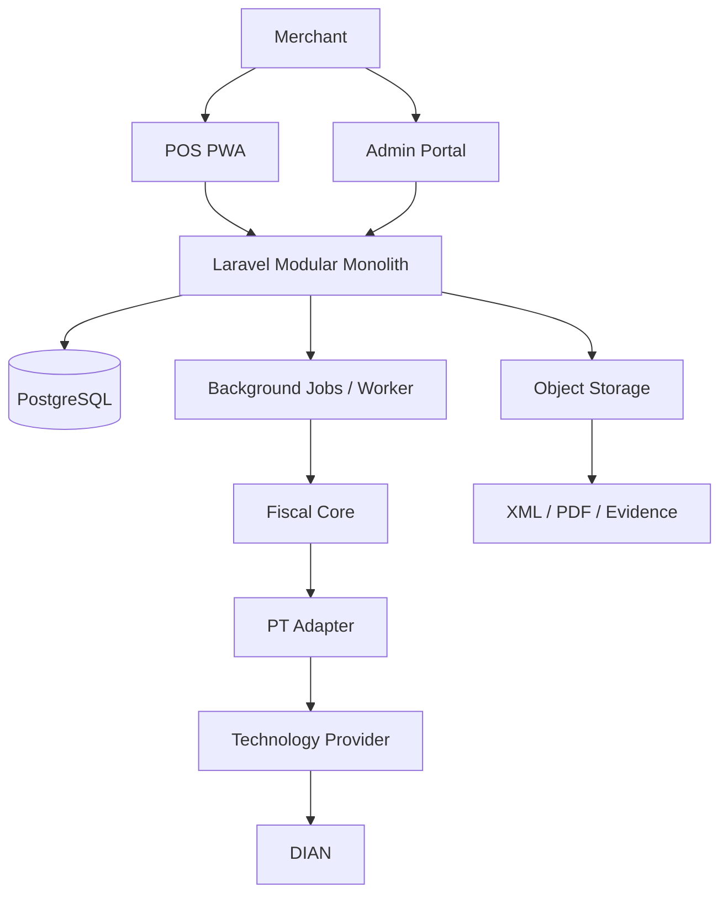
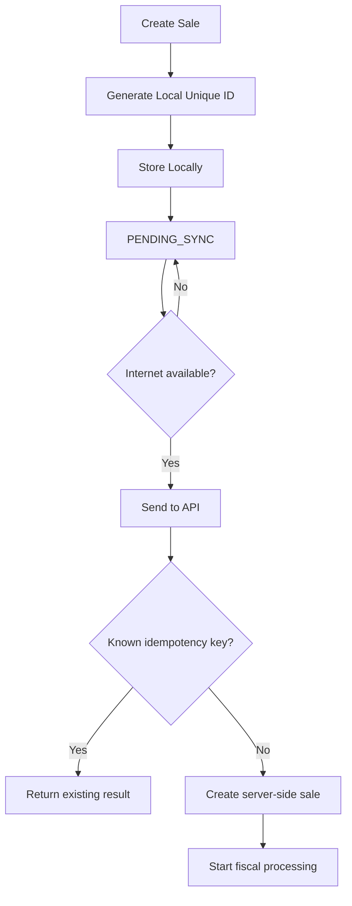
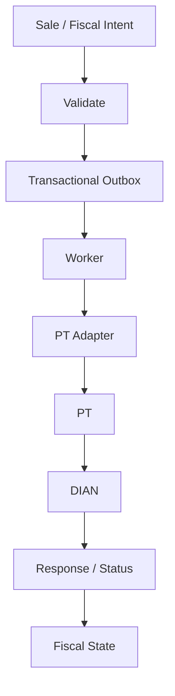

# API DIAN + POS — Draft Product Architecture V1

> **Status:** DRAFT / NON-BINDING  
> **Purpose:** Preserve the current architecture direction for review before Phase 6 detailed design.  
> **Rule:** This document is not a final implementation decision. It may be replaced after detailed validation.

## 1. Product this architecture must support

The product is a SaaS platform for Colombian merchants that combines:

- POS and sales;
- cash management;
- customers and suppliers;
- products and inventory;
- purchases;
- purchases on credit;
- accounts payable;
- sales on credit;
- accounts receivable;
- electronic invoicing;
- credit notes;
- debit notes;
- XML/PDF/status management;
- offline-capable POS operation;
- branches and users;
- auditability;
- duplicate prevention;
- reconciliation;
- integration with one authorized Technology Provider (PT) initially.

Primary constraint:

> The first production stage must be realistically operable by one person and should minimize fixed infrastructure and operational complexity.

---

## 2. Architecture decision under evaluation

### Selected draft direction

**Managed modular monolith**

Core characteristics:

- one main backend application;
- one primary PostgreSQL database;
- modular internal boundaries;
- background workers for fiscal and asynchronous processes;
- object storage for XML/PDF/evidence;
- one PT adapter initially;
- no microservices at launch;
- no Kubernetes at launch;
- no Kafka at launch;
- no Redis requirement at launch unless benchmarks prove it necessary.

This direction is preferred because it minimizes deployment, debugging, monitoring and maintenance burden while preserving a clean path to scale later.

---

## 3. High-level system



---

## 4. Proposed technology direction

### Backend

**Laravel modular monolith**

Why it is currently preferred:

- one framework for API, validation, ORM, migrations, queues, scheduled jobs and testing;
- low operational overhead for a solo operator;
- supports transactional business workflows well;
- avoids splitting the fiscal, sales and inventory domains into distributed services too early.

### Frontend

**Vue 3 + TypeScript**

### POS

**Installable PWA with offline-first behavior**

Initial local persistence:

- IndexedDB;
- locally generated unique sale identifier;
- pending synchronization queue;
- retry-safe synchronization.

### Database

**PostgreSQL**

### Multi-tenancy

Initial draft model:

- shared database;
- tenant-scoped records using `tenant_id`;
- strict authorization and query scoping;
- explicit tests for cross-tenant leakage.

### Background processing

Initial preference:

- database-backed jobs / transactional outbox;
- dedicated worker process;
- Redis only when measured load or latency justifies it.

### File and evidence storage

S3-compatible managed object storage for:

- XML;
- PDF;
- DIAN/PT responses;
- integrity evidence;
- other fiscal artifacts.

### Infrastructure principle

Use managed services whenever possible so the operator does not need to maintain database servers, storage clusters or orchestration infrastructure manually.

---

## 5. Internal modules

Proposed logical modules:

```text
Identity
Tenants
Branches
Catalog
Inventory
Sales
Purchases
Cash
Customers
Suppliers
Receivables
Payables
Fiscal
PT
Documents
Notifications
Billing
Reporting
Audit
```

These modules live inside one application initially.

They are boundaries for maintainability, not independent network services.

---

## 6. Core data model direction

Important aggregate areas include:

```text
tenants
branches
devices
users

products
product_variants
stock_movements

customers
suppliers

sales
sale_lines
payments

cash_sessions
cash_movements

purchases
purchase_lines

receivables
receivable_payments

payables
payable_payments

fiscal_documents
fiscal_attempts
fiscal_events

document_artifacts

outbox_jobs
idempotency_keys

audit_log

subscriptions
usage
```

This is only a draft domain inventory. Final schema belongs to Phase 6 detailed design.

---

## 7. Inventory design principle

Inventory should be traceable through movements rather than relying only on a mutable quantity field.

Example:

```text
Purchase         +50
Sale              -2
Return             +1
Adjustment         -3
Transfer          -10
```

The current stock is derived from controlled movements and may also use cached balances for performance later.

---

## 8. Purchases and supplier credit

The model should keep these concepts separate:

```text
Supplier
   ↓
Purchase
   ↓
Inventory receipt
   ↓
Accounts payable
   ↓
Payments / partial payments
   ↓
Remaining balance
```

A purchase is not the same thing as a payable.

This permits:

- cash purchases;
- purchases on credit;
- due dates;
- partial payments;
- supplier balances;
- supplier credit notes;
- inventory adjustments related to returns.

---

## 9. Sales and customer credit

The same separation applies to receivables:

```text
Customer
   ↓
Sale
   ↓
Credit sale
   ↓
Account receivable
   ↓
Partial payments
   ↓
Remaining balance
```

This provides basic commercial credit without turning V1 into a full accounting ERP.

---

## 10. POS offline direction

The POS should not depend on permanent connectivity for the commercial act when safe and permitted.

Draft flow:



Important principle:

> Local retries must never create duplicate server-side sales.

The final legal/fiscal behavior of offline operation and contingencies still requires PT/DIAN validation.

---

## 11. Separate commercial sale from fiscal document

Draft rule:

```text
SALE
= commercial transaction

FISCAL_DOCUMENT
= fiscal lifecycle associated with that transaction
```

This separation allows the commercial workflow and the fiscal workflow to have different states.

Example:

```text
Sale: COMPLETED
Fiscal document: PENDING / UNKNOWN / ACCEPTED / REJECTED
```

The exact conditions under which the merchant may continue operating during DIAN/PT incidents remain subject to regulatory and PT validation.

---

## 12. Fiscal processing core

Draft flow:



Candidate internal states:

```text
CREATED
QUEUED
SENDING
ACCEPTED
REJECTED
UNKNOWN
RECONCILING
FAILED
```

User-facing states should be simpler, for example:

```text
Pending
Accepted
Rejected
Requires attention
```

---

## 13. Idempotency and duplicate prevention

Every fiscal operation must have a stable internal identity.

The system should prevent a retry caused by:

- POS reconnection;
- HTTP timeout;
- worker crash;
- duplicate click;
- delayed response;

from creating a second commercial sale or a second fiscal document unintentionally.

Ambiguous PT outcomes should transition to `UNKNOWN` / reconciliation rather than automatically generating a new fiscal operation.

---

## 14. Transactional outbox

Critical draft consistency rule:

```text
BEGIN TRANSACTION

create / update sale
create fiscal document intent
create outbox job

COMMIT
```

This prevents a state where the sale is persisted but the fiscal job is silently lost.

A worker later processes the outbox record.

---

## 15. PT isolation

The product must not spread PT-specific code throughout sales, POS or inventory modules.

Draft boundary:

```text
Fiscal Core
    ↓
FiscalProvider interface
    ↓
HKA / DATAICO / selected PT adapter
```

Conceptual capabilities may include:

```text
sendInvoice()
sendCreditNote()
sendDebitNote()
getStatus()
getXml()
getPdf()
reconcile()
```

Exact methods must be based on the selected PT's real API and contract, not assumptions.

Only one PT adapter should be implemented initially.

---

## 16. What our platform should own

The platform should own the canonical business state for:

- tenants;
- users;
- branches;
- devices;
- products;
- inventory;
- customers;
- suppliers;
- sales;
- purchases;
- cash;
- receivables;
- payables;
- internal fiscal state;
- idempotency;
- reconciliation history;
- audit logs;
- subscriptions and usage.

---

## 17. What should be delegated to the PT where appropriate

The draft intent is to delegate only external fiscal complexity that is better handled by the authorized PT, such as:

- DIAN communication;
- fiscal submission;
- external validation;
- signing/certificate operations when the chosen PT model supports and contractually permits it;
- provider-specific queries and artifact retrieval.

The final responsibility split must be confirmed against the selected PT and DIAN requirements.

---

## 18. Security baseline

Phase 6 should design at minimum:

- TLS everywhere;
- secrets outside source code;
- MFA for privileged users;
- role-based access;
- strict tenant isolation;
- rate limiting;
- complete audit trail for sensitive changes;
- fiscal idempotency controls;
- encrypted secret storage;
- backup and restore procedures;
- integrity verification for fiscal artifacts;
- no storage of payment-card credentials;
- PT master credentials never exposed to the POS.

---

## 19. Scaling strategy

### Stage 1

```text
Laravel
PostgreSQL
Database-backed jobs
Object storage
1 worker
```

### Stage 2

If measured traffic requires it:

```text
Multiple API instances
Larger PostgreSQL plan
Multiple workers
Redis queue if justified
Object storage
```

### Stage 3

Only when justified by actual bottlenecks:

```text
Load balancing
Independent worker scaling
Read / connection optimizations
Potential extraction of a specific module
```

Microservices should be introduced only after a measured operational or scaling reason exists.

---

## 20. Explicit non-decisions

This draft does **not** yet permanently decide:

- final cloud provider;
- final PostgreSQL provider;
- final object storage vendor;
- final PT;
- final schema;
- final API contract;
- final fiscal state machine;
- final queue backend;
- production capacity numbers;
- production SLA;
- exact offline fiscal rules;
- exact certificate custody model.

Those belong to detailed design and external validation.

---

## 21. Explicitly rejected for initial architecture

Unless new evidence proves otherwise:

- Kubernetes;
- microservices-first architecture;
- Kafka;
- one database per merchant;
- multiple PT integrations at launch;
- public third-party API at launch;
- separate native Windows, Android and iOS applications;
- self-managed database clusters;
- distributed architecture added only for theoretical future scale.

---

## 22. Current draft conclusion

### Draft architecture direction

```text
POS PWA + Admin Web
        ↓
Laravel Modular Monolith
        ↓
PostgreSQL
        ↓
Transactional Outbox + Worker
        ↓
Fiscal Core
        ↓
PT Adapter
        ↓
Authorized PT
        ↓
DIAN

Object Storage → XML / PDF / Evidence
```

### Why this direction exists

It currently provides the best balance between:

- low initial cost;
- low operational burden;
- strong transactional consistency;
- maintainability by one operator;
- support for offline POS synchronization;
- clear fiscal boundaries;
- ability to replace PT integrations later;
- ability to scale vertically and horizontally before introducing distributed services.

---

## 23. Next required phase

**Phase 6 — Detailed Architecture Design**

Before implementation, define and review:

- module boundaries;
- complete domain model;
- database schema;
- API contracts;
- sales flow;
- purchase flow;
- receivables/payables flow;
- inventory movement rules;
- POS offline synchronization;
- idempotency model;
- fiscal state machine;
- PT adapter contract;
- reconciliation;
- contingency behavior;
- authorization model;
- tenant isolation;
- audit model;
- backups and restore;
- observability;
- deployment topology;
- capacity assumptions;
- cost model.

Only after Phase 6 and technical validation should this draft be promoted to a final architecture decision.
