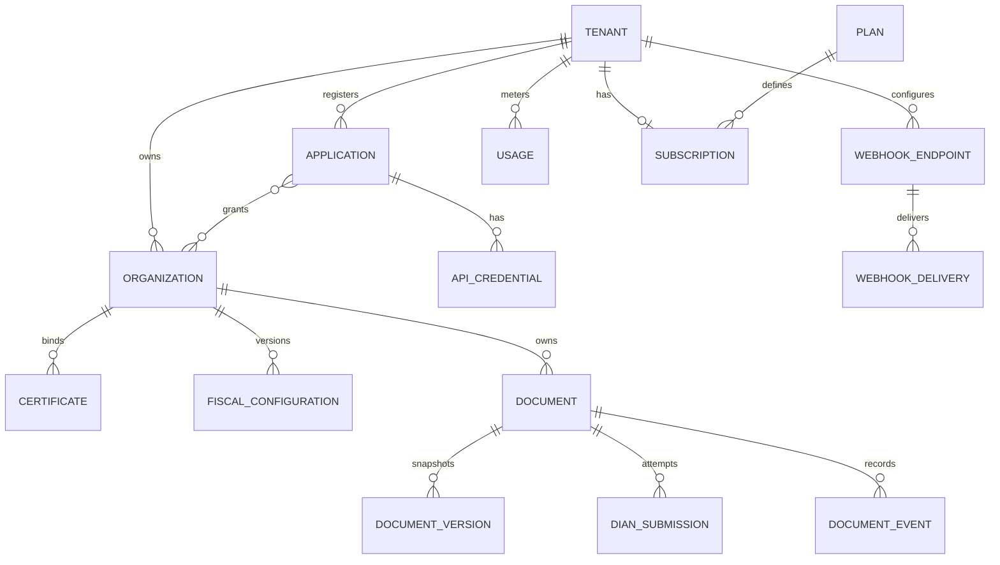

# Arquitectura de datos y multitenancy

## Definiciones exactas

| Entidad | Significado |
|---|---|
| Tenant | frontera comercial y de seguridad: cliente directo o integrador |
| Organization | persona jurídica/natural emisora fiscal dentro del tenant |
| Application | software registrado que consume la API |
| User | humano que administra tenant/organizaciones; no autentica tráfico fiscal máquina-a-máquina |
| API Credential | secreto revocable de una aplicación y ambiente |
| Environment | `sandbox` o `production`; datos, llaves y endpoints separados |
| Certificate | metadatos y binding de firma; clave privada preferiblemente custodiada por PT |
| Fiscal Configuration | numeración, tributos, responsabilidades y versión efectiva de reglas |
| Document | identidad lógica y estado fiscal canónico |
| Document Version | snapshot inmutable del payload normalizado/reglas |
| Document Event | transición o evento fiscal append-only |
| DIAN Submission | intento remoto, correlación, resultado y evidencia |
| Webhook Endpoint/Delivery | destino y cada intento de notificación |
| Usage | ledger inmutable de consumo cobrable/no cobrable |
| Plan/Subscription/Quota | política comercial y límites efectivos |
| Audit Log | acción sensible, actor, objetivo y resultado sin secretos |

Un tenant integrador puede administrar varias organizaciones; una organización solo pertenece a un tenant. Una aplicación accede únicamente a organizaciones concedidas explícitamente. Un comercio directo se representa como tenant con una organización.

## Modelo lógico

## Claves e invariantes

- Todas las tablas de negocio llevan `tenant_id`; las fiscales llevan además `organization_id` y `environment`.
- PK interna UUIDv7; identificadores públicos opacos con prefijo (`doc_`, `org_`, `app_`).
- FK compuestas incluyen `tenant_id` para impedir referencias cruzadas incluso si falla la aplicación.
- `UNIQUE(tenant_id, environment, application_id, idempotency_key)`.
- `UNIQUE(tenant_id, organization_id, environment, document_type, fiscal_prefix, fiscal_number)` cuando aplique.
- Payload canónico, versión de reglas, hash y artefactos aceptados son inmutables; una corrección crea documento/versión conforme a norma.
- Dinero usa decimal fijo y código ISO 4217; nunca `float`.
- Fechas fiscales conservan zona/origen y UTC.

## Defensa de aislamiento

1. La credencial resuelve un principal `{tenant, application, environment, scopes}` en el borde.
2. `organization_id` proviene de ruta/payload pero se valida contra grants de la aplicación.
3. La transacción ejecuta `SET LOCAL app.tenant_id` y RLS deny-by-default.
4. Repositorios exigen `tenant_id`; no existen métodos globales en el camino público.
5. Worker toma metadata global con rol separado, fija tenant antes de leer dominio y libera contexto al terminar.
6. Object keys usan IDs opacos y su descarga requiere autorización; no se aceptan keys del cliente.
7. Backups, logs, métricas y soporte mantienen controles equivalentes.

Pruebas obligatorias: matriz BOLA para cada endpoint, RLS directa, pool reuse, worker cross-tenant, signed URL, exports, webhooks y rol de soporte.

## Retención

La política concreta se parametriza por obligación legal y contrato. Borrar una cuenta no elimina automáticamente documentos/evidencia sujetos a retención. Se aplica legal hold, soft-delete comercial y borrado criptográfico al vencer la retención. La duración no se codifica como constante sin validación jurídica.

