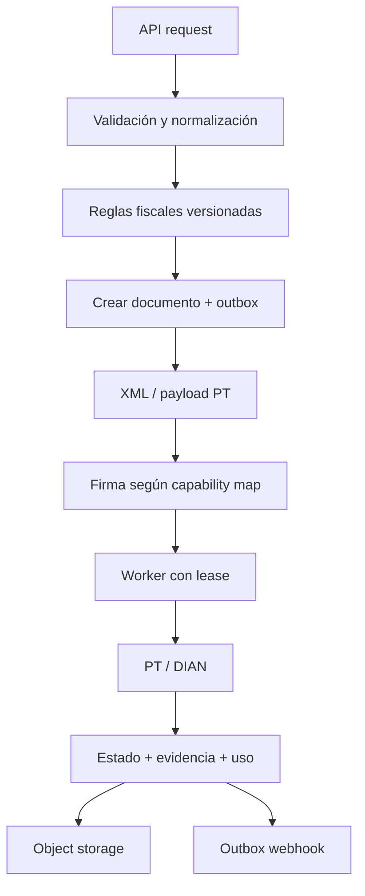

# Procesamiento fiscal, colas y webhooks

## Pipeline autoritativo



## Camino de escritura

1. Autenticar aplicación, ambiente, scope y grant de organización.
2. Aplicar límite y validar `Idempotency-Key`.
3. Validar tamaño/esquema; normalizar sin perder la entrada auditada.
4. Cargar configuración y reglas efectivas; comprobar cálculos y referencias.
5. En una transacción: crear documento/versión/evento, idempotency record y work item/outbox.
6. Responder 202. Ninguna llamada remota ocurre dentro de la transacción HTTP.
7. Worker adquiere lease con `FOR UPDATE SKIP LOCKED`, prepara intento inmutable y persiste antes del side effect.
8. Adapter firma/genera/envía según capability map del PT.
9. Clasificar resultado: aceptado, rechazado determinista, no enviado probado o ambiguo.
10. Persistir estado/evidencia/artefactos/usage y encolar webhook en una transacción.

## Síncrono y asíncrono

El contrato es asíncrono por defecto. Espera corta opcional solo observa el mismo workflow. Consultas, descargas pequeñas y validación sin side effect son síncronas. Reportes, lotes, reenvíos de webhook y reconciliaciones son jobs.

## Outbox y cola

- V1 reutiliza PostgreSQL para work items y outbox: menos piezas y atomicidad local.
- Filas tienen `available_at`, `lease_owner`, `lease_expires_at`, `attempt_count`, prioridad y tipo.
- Lease expirado recupera trabajo; la máquina de estados y el registro de intento impiden duplicar side effects.
- Backoff exponencial con jitter y máximo por clase de error.
- Agotamiento o error no reintentable mueve a `dead_letter` lógico y alerta.
- Partición/índices por estado/fecha; purge solo después de archivar evidencia requerida.
- Pub/Sub/SQS aparece cuando benchmark demuestre que polling/contención es cuello de botella; PostgreSQL conserva autoridad y outbox.

## DIAN/PT y ambigüedad

| Resultado | Acción |
|---|---|
| aceptación verificable | `accepted`, artefactos y webhook |
| rechazo determinista | `rejected_dian`, no retry automático salvo nuevo documento/corrección válida |
| fallo antes de enviar demostrable | retry permitido |
| timeout/desconexión después de posible envío | `unknown`; prohibido reenviar |
| PT caído | backoff, circuit breaker y cola; no perder orden |
| DIAN caído declarado/aplicable | activar workflow de contingencia conforme a regla vigente |

Reconciliación consulta por identificadores PT/DIAN/CUFE y compara evidencia. Un operador solo puede ejecutar acciones allowlist, con razón, doble confirmación para acciones de alto riesgo y audit log.

## Capability map del PT

Por familia y versión registra quién ejecuta: XML, firma, numeración, submit, status, PDF, entrega, contingencia y almacenamiento. Una capacidad no confirmada en contrato+sandbox queda `unsupported`; nunca se completa por suposición.

## Webhooks

Eventos V1: `document.received`, `document.accepted`, `document.rejected`, `document.unknown`, `document.reconciled`, `artifact.ready`, `certificate.expiring`, `quota.threshold_reached`.

Envelope:

```json
{
  "id": "evt_01...",
  "type": "document.accepted",
  "created_at": "2026-09-07T15:16:00Z",
  "tenant_id": "ten_01...",
  "data": {"document_id": "doc_01...", "status": "accepted"}
}
```

- HTTPS solamente; no redirects; DNS/IP revalidada para mitigar SSRF.
- Firma HMAC SHA-256 sobre `timestamp.body`; headers `Webhook-Id`, `Webhook-Timestamp`, `Webhook-Signature`.
- Dos secretos válidos durante rotación; protección de replay con timestamp.
- Timeout corto; 2xx confirma; 3xx/4xx no permanentes según política; 429/5xx reintentan.
- Al menos una entrega; consumidor deduplica por `Webhook-Id`.
- Retry sugerido: inmediato, 1m, 5m, 30m, 2h, 8h, 24h; luego dead-letter 30 días y replay manual.
- Nunca se envían XML completo, PII innecesaria ni secretos en el evento; el cliente consulta con autorización.

