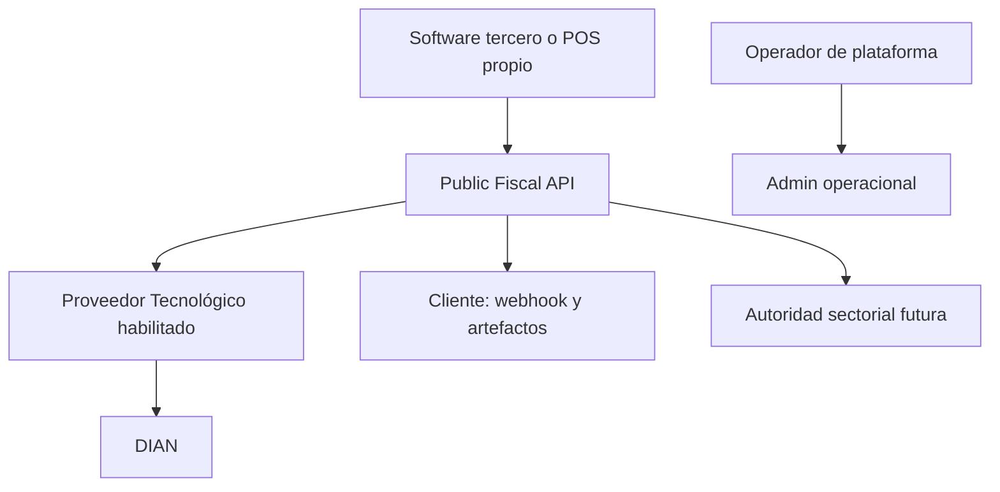
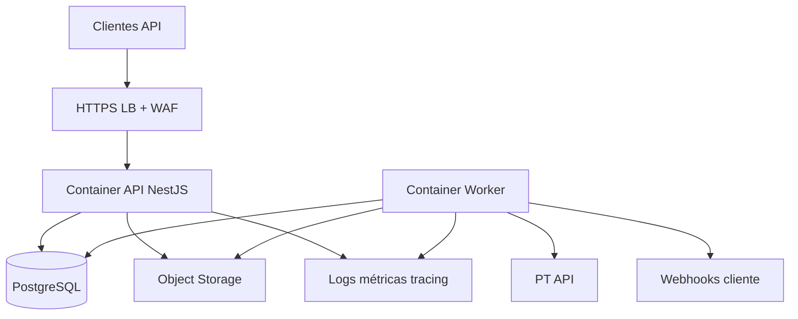

# Contexto, contenedores y componentes

## Contexto

El cliente envía intención fiscal, no XML específico del PT. La plataforma valida, normaliza, aplica reglas, crea el documento y controla el ciclo. El PT es una dependencia intercambiable detrás de un puerto; DIAN y futuras autoridades sectoriales son sistemas externos.

## Contenedores de despliegue

API y worker usan la misma imagen y código, con comandos distintos. Escalan por separado. PostgreSQL es la autoridad para documentos, estados, idempotencia, outbox, leases, uso y auditoría. Object storage contiene bytes; nunca decide estado.

## Componentes del monolito modular

| Módulo | Responsabilidad | No puede hacer |
|---|---|---|
| Identity & Access | tenants, apps, usuarios, credenciales, scopes | decidir reglas fiscales |
| Organizations | emisores legales, ambientes y configuración | llamar al PT |
| Fiscal Documents | agregado, versiones, relaciones y estado | conocer esquema privado del PT |
| Validation & Rules | esquema canónico y reglas versionadas | persistir por fuera de repositorios tenant-safe |
| Rendering & Artifacts | XML/PDF/evidencia y checksums | ser fuente de verdad del estado |
| Provider Adapter | traducción, submit, query y normalización | filtrar errores PT al contrato público |
| Workflow | outbox, leases, retry, reconciliación, kill switches | reemitir cuando resultado es ambiguo |
| Webhooks | endpoints, firma, deliveries y retry | bloquear el ciclo fiscal por fallo receptor |
| Metering & Billing | ledger de uso, cuota y plan | modificar documentos fiscales |
| Audit & Operations | eventos append-only, panel y acciones controladas | editar evidencia histórica |

Dependencia permitida: entrada pública → aplicación → dominio → puertos → adaptadores. Un adaptador no es importado por el dominio.

## Stack V1

- Node.js 24 LTS, TypeScript estricto;
- NestJS sobre Fastify;
- SQL parametrizado explícito y migraciones versionadas;
- PostgreSQL 16+ administrado;
- contenedores OCI;
- OpenAPI 3.1 generado y validado en CI;
- OpenTelemetry para trazas;
- Terraform para infraestructura;
- GitHub Actions para CI/CD.

La implementación existente de persistencia, worker, fake provider y pruebas de concurrencia se adapta; no se reconstruye sin causa.

