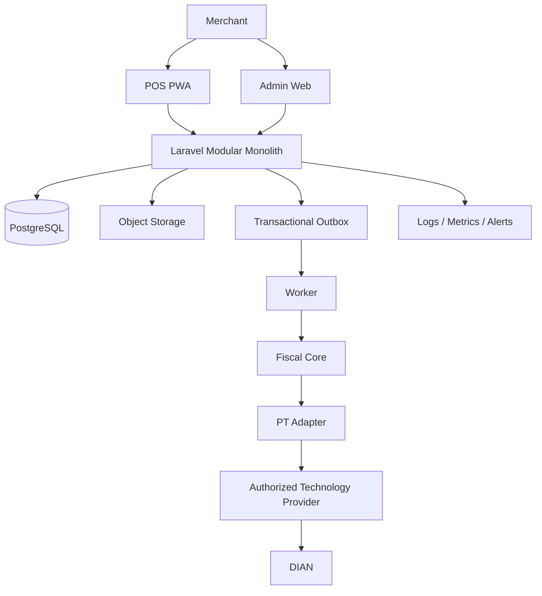
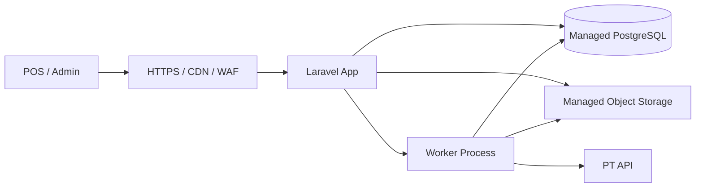
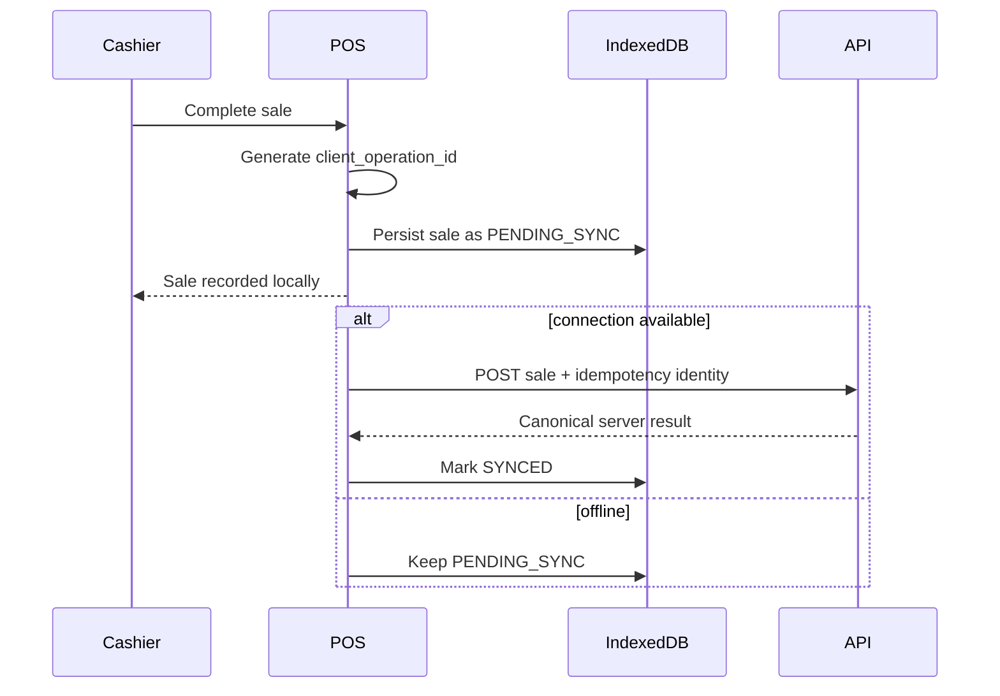
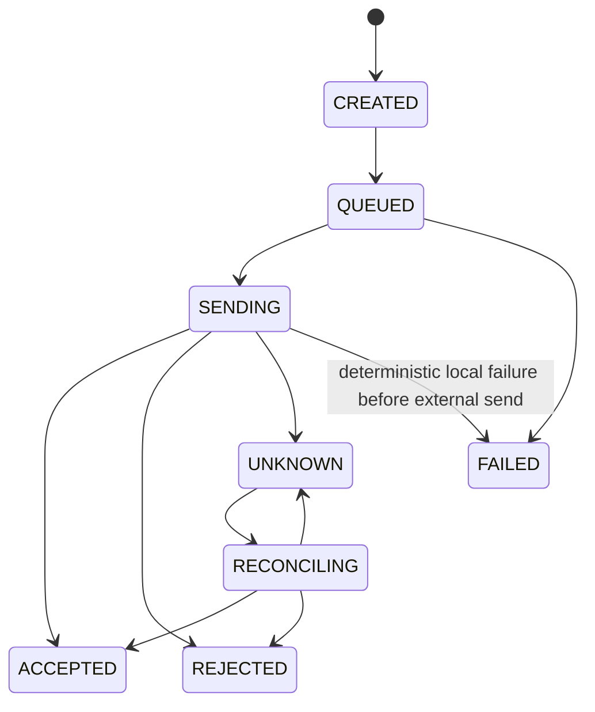
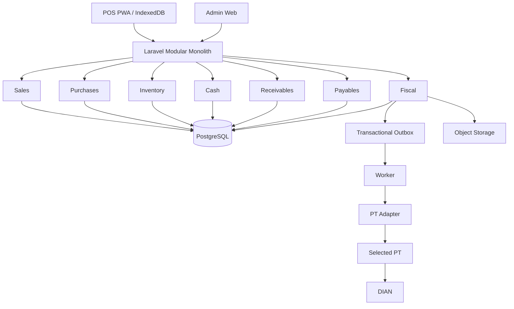

# API DIAN + POS — Phase 6 Detailed Architecture Design

> **Status:** DRAFT / NON-BINDING
> **Branch:** `draft/architecture-product-v1`
> **Purpose:** Translate the approved product direction into a detailed architecture blueprint before implementation.
> **Important:** This document is a working design, not a production authorization. Phase 7 validation and external PT/regulatory evidence may still change parts of it.

---

# 1. Product boundary

The system is a SaaS platform for Colombian merchants that combines:

- POS sales;
- cash management;
- products and inventory;
- customers and suppliers;
- purchases;
- purchases on credit;
- accounts payable;
- sales on credit;
- accounts receivable;
- electronic invoicing;
- credit/debit notes;
- XML/PDF/status handling;
- branch/user/device management;
- offline POS synchronization;
- auditability;
- fiscal retry/reconciliation;
- one PT integration initially.

The system is **not** initially:

- a full accounting ERP;
- a payroll suite;
- a CRM;
- an ecommerce platform;
- a payment processor;
- a multi-PT routing platform;
- a public third-party API product.

---

# 2. Architecture principles

1. **One application first.** Use a modular monolith before distributed services.
2. **One source of truth.** PostgreSQL owns canonical business state.
3. **Commercial and fiscal state are separate.** A sale is not the same object as a fiscal document.
4. **Every write must be tenant-scoped.** No implicit global business queries.
5. **Inventory is movement-based.** Stock changes are traceable.
6. **Credit is separate from sale/purchase.** Receivables/payables are their own ledgers.
7. **Fiscal delivery is asynchronous.** POS should not block on PT latency when not strictly required.
8. **Ambiguity is a state, not an error to hide.** Unknown PT outcomes become `UNKNOWN` and reconcile later.
9. **Retries must be idempotent.** Retrying must not create a second sale or fiscal document.
10. **PT-specific behavior stays behind an adapter.** No PT logic in Sales, Inventory or UI.
11. **Managed infrastructure first.** Reduce solo-operator burden.
12. **No speculative scaling.** Redis, microservices and additional infrastructure appear only after measured need.

---

# 3. System context



---

# 4. Deployment topology

## Initial production topology



Initial processes:

- 1 web/API process;
- 1 worker process;
- 1 managed PostgreSQL instance;
- 1 object storage bucket/namespace;
- external monitoring/alerting;
- one PT adapter.

The worker and API may run from the same codebase but as separate runtime processes.

---

# 5. Module boundaries

## 5.1 Identity

Responsibilities:

- users;
- authentication;
- MFA for privileged users;
- password/session lifecycle;
- role assignments.

Must not own:

- tenant business rules;
- sales;
- fiscal logic.

## 5.2 Tenants

Responsibilities:

- merchant/company identity;
- tenancy lifecycle;
- legal/business configuration;
- active/suspended status;
- plan association.

## 5.3 Branches & Devices

Responsibilities:

- branches;
- POS devices;
- device registration;
- local sequence/device identity;
- device revocation.

## 5.4 Catalog

Responsibilities:

- products;
- variants;
- categories;
- SKU;
- barcode;
- price;
- tax classification references.

## 5.5 Inventory

Responsibilities:

- inventory movements;
- stock balances;
- adjustments;
- branch stock;
- transfer support when enabled.

Invariant:

> No stock change may happen without a movement record.

## 5.6 Customers

Responsibilities:

- customer identity;
- fiscal contact data;
- consumer-final handling;
- receivable association.

## 5.7 Suppliers

Responsibilities:

- supplier identity;
- supplier contact/fiscal data;
- purchase association;
- payable association.

## 5.8 Sales

Responsibilities:

- sale header;
- sale lines;
- totals;
- discounts;
- taxes;
- payment allocation;
- sale lifecycle;
- return/correction intent.

Must not directly call the PT.

## 5.9 Cash

Responsibilities:

- cash session/opening;
- cash movements;
- expected vs counted cash;
- close variance;
- cashier attribution.

## 5.10 Purchases

Responsibilities:

- purchase header;
- purchase lines;
- receipt of goods;
- purchase totals;
- cash/credit condition;
- supplier document attachment reference.

## 5.11 Receivables

Responsibilities:

- accounts receivable;
- installments if later needed;
- due dates;
- partial payments;
- balance;
- status.

## 5.12 Payables

Responsibilities:

- accounts payable;
- due dates;
- partial payments;
- balance;
- supplier credit note effects.

## 5.13 Fiscal

Responsibilities:

- fiscal intent;
- canonical fiscal document state;
- idempotency;
- numbering coordination when applicable;
- submission orchestration;
- retries;
- `UNKNOWN` state;
- reconciliation;
- fiscal events;
- artifact association.

## 5.14 PT

Responsibilities:

- PT adapter interface;
- selected provider implementation;
- request/response translation;
- provider-specific authentication;
- provider-specific error normalization.

## 5.15 Documents

Responsibilities:

- XML/PDF/evidence metadata;
- hashes;
- object-storage keys;
- artifact retrieval authorization.

## 5.16 Notifications

Responsibilities:

- email/other delivery of receipts or invoices;
- retryable notification jobs;
- delivery status.

## 5.17 Billing & Usage

Responsibilities:

- subscription plan;
- included document allowance;
- usage counters;
- overage calculation inputs.

## 5.18 Reporting

Responsibilities:

- read models;
- dashboards;
- aggregates;
- exports.

Reporting must not become source of truth for balances.

## 5.19 Audit

Responsibilities:

- security-sensitive actions;
- business corrections;
- fiscal state transitions;
- actor/time/source metadata.

---

# 6. Module dependency rules

Allowed high-level direction:

```text
UI/API
  ↓
Application Services
  ↓
Domain Modules
  ↓
Persistence / Integrations
```

Critical restrictions:

- `Sales` may request fiscal processing through a Fiscal application interface, but may not call the PT adapter.
- `Inventory` may react to confirmed sale/purchase events, but should not own sale/purchase state.
- `Receivables` depends on finalized commercial sale data, not fiscal acceptance.
- `Payables` depends on purchase terms, not inventory balance.
- `Fiscal` may reference a commercial source document but must preserve its own lifecycle.
- `PT` may depend on `Fiscal` contracts; `Fiscal` must not depend on a concrete PT class.

---

# 7. Core domain model

## Tenant and access

```text
tenant
branch
device
user
role
user_role
```

## Catalog and inventory

```text
product
product_variant
barcode
stock_balance
stock_movement
```

## Sales

```text
sale
sale_line
sale_payment
sale_adjustment
```

## Cash

```text
cash_session
cash_movement
cash_close
```

## Purchases

```text
purchase
purchase_line
purchase_receipt
supplier_document
```

## Credit

```text
receivable
receivable_payment
payable
payable_payment
```

## Fiscal

```text
fiscal_document
fiscal_attempt
fiscal_event
fiscal_reconciliation
idempotency_key
outbox_message
```

## Artifacts and audit

```text
document_artifact
audit_log
```

## Commercial billing

```text
subscription
usage_counter
usage_event
```

---

# 8. Key database rules

Every tenant-owned table should include, where relevant:

```text
id
 tenant_id
 created_at
 updated_at
```

Branch-specific records also include:

```text
branch_id
```

Device-originated offline operations include:

```text
device_id
client_operation_id
```

Recommended IDs:

- UUID/ULID generated by trusted application layer;
- never expose sequential database IDs as the only public identifier.

Critical unique constraints should include tenant context.

Examples:

```text
UNIQUE (tenant_id, sku)
UNIQUE (tenant_id, device_id, client_operation_id)
UNIQUE (tenant_id, idempotency_key)
```

---

# 9. Sale lifecycle

Candidate commercial states:

```text
DRAFT
OPEN
COMPLETED
VOIDED
RETURNED_PARTIAL
RETURNED_FULL
```

A completed sale is immutable in its core financial facts.

Corrections should be recorded as explicit adjustment/return operations rather than silently editing historical totals.

---

# 10. Purchase lifecycle

Candidate states:

```text
DRAFT
RECEIVED_PARTIAL
RECEIVED
CANCELLED
RETURNED_PARTIAL
RETURNED_FULL
```

Purchase and inventory receipt may be separate operations to allow future partial receiving.

For V1, full receipt can be the default simpler path while preserving the model boundary.

---

# 11. Inventory model

## Movement types

Initial candidate set:

```text
PURCHASE_RECEIPT
SALE
SALE_RETURN
PURCHASE_RETURN
MANUAL_ADJUSTMENT_IN
MANUAL_ADJUSTMENT_OUT
TRANSFER_IN
TRANSFER_OUT
```

Each movement should contain:

```text
id
tenant_id
branch_id
product_variant_id
type
quantity_delta
source_type
source_id
actor_id
occurred_at
```

`stock_balance` may exist as a materialized/cached balance for fast reads, but the movement ledger remains the audit trail.

Invariant:

> A stock balance update and its movement record must be committed atomically.

---

# 12. Accounts receivable

Creating a credit sale should atomically create:

```text
Sale
+ Receivable
```

The receivable contains:

```text
original_amount
outstanding_amount
due_date
status
```

Candidate statuses:

```text
OPEN
PARTIALLY_PAID
PAID
OVERDUE
CANCELLED
```

Partial payments create immutable `receivable_payment` records and reduce the outstanding balance transactionally.

---

# 13. Accounts payable

A purchase on credit should create:

```text
Purchase
+ Payable
```

Supplier payments produce immutable `payable_payment` rows.

Supplier credit notes or approved purchase returns adjust the payable through explicit adjustment records; historical payment records must not be rewritten.

---

# 14. POS offline architecture

## Local store

Use IndexedDB to hold only what the POS requires for resilient operation:

- cached product catalog subset;
- prices/taxes needed for sale;
- branch/device identity;
- pending operations;
- sync checkpoints;
- locally generated operation IDs.

Do not store PT secrets locally.

## Offline sale creation



## Sync contract

The server must treat:

```text
tenant_id + device_id + client_operation_id
```

as a stable uniqueness boundary.

If the same operation is received multiple times, the server returns the already-created canonical sale rather than creating a second one.

## Conflict rule

For financial operations, prefer explicit rejection/review over silent last-write-wins conflict resolution.

---

# 15. Fiscal document model

The fiscal document is separate from the sale.

Example relation:

```text
sale.id = S1
fiscal_document.source_type = SALE
fiscal_document.source_id = S1
```

Candidate fiscal document types for initial product scope:

```text
FEV
CREDIT_NOTE
DEBIT_NOTE
```

DEE POS remains an expansion candidate unless later promoted.

---

# 16. Fiscal state machine

Candidate states:

```text
CREATED
QUEUED
SENDING
ACCEPTED
REJECTED
UNKNOWN
RECONCILING
FAILED
```



Important rule:

> A timeout after a request may have reached the PT must not automatically transition to `FAILED`. It must become `UNKNOWN` until reconciled.

---

# 17. Fiscal idempotency

Each fiscal operation gets a stable internal idempotency identity.

Sources of duplicate attempts may include:

- POS retry;
- HTTP retry;
- worker crash;
- process restart;
- duplicate user action;
- PT timeout;
- webhook arriving after polling.

The system should distinguish:

```text
same operation retry
```

from:

```text
new correction/new fiscal document
```

A retry must reuse the same fiscal operation identity.

---

# 18. Transactional outbox

For any operation that must trigger asynchronous work:

```text
BEGIN

write domain change
write outbox_message

COMMIT
```

The worker later locks and processes outbox rows.

Minimum outbox fields:

```text
id
tenant_id
type
aggregate_type
aggregate_id
payload_version
payload
available_at
locked_at
processed_at
attempt_count
last_error
```

Initial queue strategy:

- database-backed outbox/jobs;
- row locking / lease semantics;
- retry with bounded backoff;
- dead-letter/review state after threshold.

Redis may replace the transport later, but should not replace the need for durable domain state.

---

# 19. Worker lease model

To avoid two workers processing the same job simultaneously:

- lock/claim a job atomically;
- include `locked_at` and `lock_owner`/lease token;
- lease expires after safe timeout;
- processing result must verify ownership before finalization.

A crashed worker leaves a recoverable leased job rather than a permanently lost task.

---

# 20. PT adapter contract

Conceptual application contract:

```text
submitInvoice(document)
submitCreditNote(document)
submitDebitNote(document)
queryStatus(reference)
recoverArtifacts(reference)
reconcile(reference)
```

Provider-specific implementation is responsible for:

- endpoint URLs;
- authentication;
- request schema mapping;
- provider error mapping;
- provider response mapping;
- provider correlation IDs;
- webhook verification if supported.

The contract must be finalized only after real PT documentation is selected.

---

# 21. Canonical fiscal payload

The application should maintain an internal provider-neutral representation of the fiscal operation.

Why:

- auditability;
- easier PT replacement;
- deterministic retry;
- provider request regeneration;
- testing.

Do not persist only the PT's raw request as the business model.

Store both:

```text
canonical fiscal data
provider request/response evidence where appropriate
```

---

# 22. Artifact storage

Object storage should hold:

- accepted XML;
- generated/retrieved PDF;
- PT/DIAN evidence files where needed;
- optional original supplier attachments.

Database metadata:

```text
document_artifact
- id
- tenant_id
- fiscal_document_id
- artifact_type
- object_key
- sha256
- size_bytes
- mime_type
- created_at
```

Never trust a client-supplied object key for authorization.

Artifact download must first authorize the tenant/document relation, then issue controlled access.

---

# 23. API design principles

Initial API is private to our POS/Admin applications.

Base rules:

- versioned path or negotiated version strategy;
- JSON application API;
- idempotency header/key for mutation endpoints where required;
- tenant resolved from authenticated context, not arbitrary request body;
- pagination for collections;
- stable error envelope;
- correlation/request ID in every request;
- no PT error objects leaked directly to POS.

Candidate domains:

```text
/api/v1/auth
/api/v1/catalog
/api/v1/inventory
/api/v1/sales
/api/v1/cash
/api/v1/purchases
/api/v1/customers
/api/v1/suppliers
/api/v1/receivables
/api/v1/payables
/api/v1/fiscal-documents
/api/v1/reports
/api/v1/settings
```

---

# 24. Example sale API flow

```text
POST /api/v1/sales
Idempotency-Key: <device-operation-id>
```

Server transaction:

1. authenticate device/user;
2. resolve tenant and branch;
3. check idempotency;
4. validate product/price/tax snapshot;
5. create sale and sale lines;
6. create payment records;
7. create inventory movements;
8. create receivable if credit sale;
9. create fiscal intent if applicable;
10. create outbox message;
11. commit;
12. return canonical sale.

---

# 25. Example purchase API flow

Server transaction:

1. authenticate;
2. resolve tenant/branch;
3. create purchase;
4. create purchase lines;
5. create inventory receipt movements;
6. create payable if purchase is on credit;
7. save supplier document metadata if supplied;
8. commit.

---

# 26. Authorization model

Initial roles:

```text
OWNER
ADMIN
CASHIER
```

Possible later:

```text
SUPERVISOR
INVENTORY_MANAGER
ACCOUNTING_VIEWER
```

Authorization checks require both:

```text
role/permission
AND
tenant/branch scope
```

Examples:

- cashier can create sales in assigned branch;
- cashier cannot change fiscal configuration;
- owner/admin can see business reports;
- sensitive actions require explicit permission and audit event.

---

# 27. Tenant isolation

Primary model:

- shared PostgreSQL database;
- shared schema initially;
- every tenant-owned row includes `tenant_id`;
- application query scopes always include tenant;
- tenant context originates from authenticated membership;
- never trust `tenant_id` supplied by browser as authority.

Defense in depth may later include PostgreSQL Row Level Security if compatibility and operational simplicity are validated.

Mandatory tests:

- tenant A cannot read tenant B by guessed ID;
- tenant A cannot mutate tenant B;
- export/download endpoints remain tenant-scoped;
- background jobs preserve tenant context;
- object-storage retrieval preserves tenant context.

---

# 28. Security design

Minimum V1 controls:

- TLS only;
- secure cookies/tokens depending on client auth design;
- MFA for OWNER/ADMIN;
- password hashing with current strong framework defaults;
- rate limiting;
- CSRF protection for browser session flows;
- secrets in environment/secret manager;
- PT secrets backend-only;
- least-privilege database credentials;
- least-privilege object storage credentials;
- audit logging;
- input validation;
- safe file upload validation;
- no card PAN/CVV storage;
- dependency scanning;
- backup encryption/provider controls;
- log redaction.

---

# 29. Audit model

Audit events should capture sensitive changes such as:

- user/role changes;
- fiscal configuration changes;
- price overrides when privileged;
- inventory manual adjustments;
- sale voids/returns;
- cash close overrides;
- payable/receivable adjustments;
- fiscal state transitions;
- PT credential/config changes;
- artifact deletion/replacement attempts.

Fields:

```text
id
tenant_id
actor_type
actor_id
action
entity_type
entity_id
before_json (selectively)
after_json (selectively)
request_id
ip/device metadata when appropriate
created_at
```

Do not log secrets.

---

# 30. Observability

Minimum signals:

## Application

- request rate;
- 4xx/5xx rates;
- latency;
- login failures;
- slow endpoints.

## Worker

- queue depth;
- oldest job age;
- jobs processed;
- retries;
- dead/review jobs;
- lease expirations.

## Fiscal

- accepted/rejected/unknown counts;
- PT latency;
- reconciliation backlog;
- artifact retrieval failures;
- provider outage indicators.

## Database

- connections;
- CPU/load from provider metrics;
- storage;
- slow queries;
- backup status.

Alerts should be actionable and sparse enough for one operator.

---

# 31. Backup and restore design

Minimum strategy:

- managed automated PostgreSQL backups;
- point-in-time recovery if financially reasonable;
- documented restore procedure;
- periodic restore test into isolated environment;
- object storage versioning/retention strategy as appropriate;
- database/object consistency verification using artifact hashes.

Restore test must prove:

1. backup exists;
2. database restores;
3. tenant data is present;
4. fiscal references remain coherent;
5. artifact hashes match expected objects;
6. restored environment cannot accidentally call production PT.

---

# 32. Failure behavior

## Database unavailable

- fail closed for writes;
- POS may preserve pending offline commercial operations locally when appropriate;
- do not fabricate successful server state.

## PT unavailable

- fiscal job remains pending/retryable;
- user sees simplified pending/attention state;
- no duplicate fiscal submission.

## Timeout after PT request

- transition to `UNKNOWN`;
- schedule reconciliation;
- do not create a new fiscal document automatically.

## Worker crash

- lease expires;
- job becomes recoverable;
- idempotent processing prevents duplicate effect.

## Object storage unavailable

- fiscal state and artifact state remain distinguishable;
- retry artifact persistence/recovery;
- accepted document must not be silently shown as fully archived until evidence is stored.

---

# 33. Configuration boundaries

Tenant fiscal configuration should be versioned/audited where changes can affect document generation.

Examples:

- legal name/NIT configuration;
- numbering ranges/prefixes;
- tax-related configuration;
- selected PT tenant account reference;
- certificate model if applicable.

A document should retain a snapshot/reference sufficient to explain how it was generated even after later configuration changes.

---

# 34. Pricing/usage architecture

Every chargeable fiscal document should generate a usage event after the business rule determining billability.

Do not derive invoices only by counting mutable document rows at billing time.

Suggested pattern:

```text
fiscal event
   ↓
usage_event
   ↓
monthly usage counter / billing calculation
```

Billing rules remain product decisions and may change without modifying fiscal document history.

---

# 35. Reporting architecture

Initial reports should query operational tables carefully or use simple read models/materialized summaries when needed.

Do not introduce a data warehouse initially.

Candidate early reports:

- daily sales;
- sales by branch/cashier/product;
- purchases;
- inventory balance;
- receivables/payables aging basics;
- fiscal document status;
- cash close summary.

---

# 36. Schema migration policy

- migrations committed to source control;
- backward-compatible changes preferred;
- no manual production schema editing;
- destructive changes require staged migration/backfill;
- backup/restore confidence before high-risk migrations.

---

# 37. CI/CD draft

Before merge/deploy:

- dependency install from lockfile;
- lint/static checks;
- unit tests;
- integration tests using isolated PostgreSQL;
- tenant isolation tests;
- idempotency/state-machine tests;
- migration validation;
- secret scanning/dependency audit where supported.

Deployment:

- migrate safely;
- deploy app;
- deploy worker from same compatible release;
- health check;
- rollback procedure documented.

No production deployment is authorized by this Phase 6 document.

---

# 38. Non-functional requirements draft

These are design targets, not yet validated SLAs.

## Availability

- commercial POS should degrade gracefully under connectivity loss;
- backend should use managed services and health checks;
- fiscal external dependency outages must not corrupt commercial data.

## Consistency

- money, inventory, receivable/payable and fiscal intent changes use database transactions;
- no silent partial multi-table business writes.

## Security

- strict tenant isolation;
- no PT credential exposure to client devices;
- sensitive actions auditable.

## Maintainability

- one deployable codebase initially;
- module boundaries enforced in code review/tests;
- avoid provider-specific logic outside integration module.

## Cost

- keep fixed infrastructure minimal;
- scale workers/DB only when metrics prove need.

---

# 39. Capacity model assumptions for Phase 7

Phase 6 does not claim validated capacity.

Phase 7 should benchmark at least these planning tiers:

```text
10 tenants
100 tenants
500 tenants
1,000 tenants
5,000 tenants
```

Test profiles should vary:

- sales/minute;
- concurrent POS devices;
- fiscal jobs/minute;
- document artifact size;
- reporting queries;
- inventory write contention.

The goal is to find the first real bottleneck before adding infrastructure.

---

# 40. Decisions intentionally deferred

Still not final:

- final PT;
- exact PT methods and payloads;
- certificate custody/signing model;
- final cloud vendor;
- final PostgreSQL vendor;
- final object-storage vendor;
- final queue backend after benchmark;
- exact offline fiscal legality/contingency behavior;
- exact numbering ownership depending on PT model;
- production SLA;
- production capacity;
- final RLS decision;
- final retention periods for all fiscal/commercial data.

---

# 41. Phase 7 validation requirements

This design should not be promoted until Phase 7 validates:

1. PostgreSQL transactional flows;
2. idempotent offline synchronization;
3. tenant isolation;
4. inventory atomicity;
5. receivable/payable balances;
6. outbox recovery;
7. worker lease recovery;
8. fiscal state machine;
9. timeout -> UNKNOWN behavior;
10. reconciliation logic;
11. backup/restore;
12. object artifact integrity;
13. security controls;
14. PT sandbox behavior;
15. basic performance/capacity.

---

# 42. Architecture summary



---

# 43. Phase 6 conclusion

## Current result

`ARCHITECTURE DESIGNED: PASS WITH RISKS`

Why not full PASS yet:

- PT behavior remains unverified;
- offline fiscal rules remain externally dependent;
- production capacity is not benchmarked;
- restore is not yet proven against the final managed database environment;
- security controls are designed but not yet fully tested.

## What is now sufficiently defined

- system shape;
- module boundaries;
- domain separation;
- data ownership;
- sales/purchases/credit/inventory flows;
- offline synchronization model;
- fiscal state machine;
- idempotency strategy;
- outbox/worker model;
- PT isolation;
- authorization and tenant model;
- audit/security baseline;
- backup/restore approach;
- observability;
- deployment direction;
- Phase 7 validation targets.

## Next phase

**Phase 7 — Technical Validation**

Do not build the full production product yet. Validate the risky architectural assumptions first.