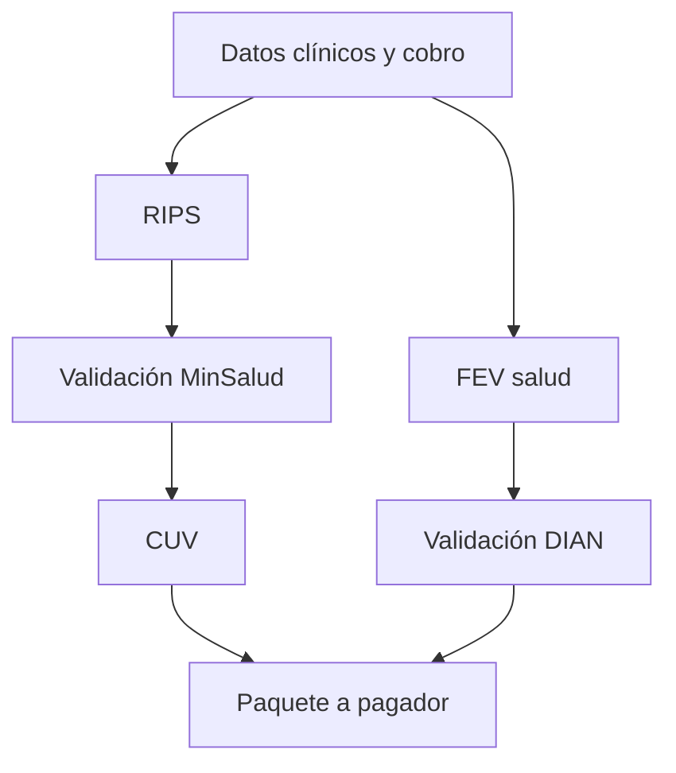

# Servicios del sector salud

## Qué cambia frente a una FEV normal

Salud no requiere otro núcleo fiscal. Reutiliza la FEV y añade:

- campos XML sectoriales;
- RIPS como soporte de la FEV;
- validación ante el mecanismo de MinSalud;
- Código Único de Validación (CUV);
- envío a entidades responsables de pago y otros pagadores;
- ajustes, soportes, devoluciones, glosas y trazabilidad sectorial.

Fuentes base: [Resolución 948 de 2026](https://www.minsalud.gov.co/sites/rid/Lists/BibliotecaDigital/RIDE/DE/DIJ/resolucion-0948-de-2026.pdf), [lineamientos FEV-RIPS](https://www.minsalud.gov.co/sites/rid/Lists/BibliotecaDigital/RIDE/DE/OT/lineamientos-generacion-validacion-rips-factura-electronica-fev-doc-electronicos.pdf) y [Resolución 2284 de 2023 sobre soportes/glosas](https://www.minsalud.gov.co/Normatividad_Nuevo/Resoluci%C3%B3n%20No%202284%20de%202023.pdf). Deben revisarse modificaciones posteriores antes de construir.

## Decisión de roadmap

Se ubica en V2 vertical. Motivos: dos autoridades externas, reglas clínicas y financieras, archivos grandes, actores adicionales y mayor carga de soporte. La arquitectura reserva `sector_profile=health`, versiones regulatorias y un workflow independiente, sin contaminar el documento fiscal base.

## Flujo conceptual

