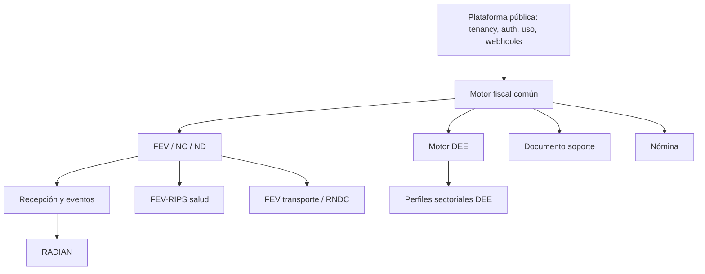

# Mapa de dependencias de servicios

La capa PT es una dependencia de salida de cada familia habilitada; no es dueña del contrato público ni del estado interno. Salud y transporte añaden autoridades externas y por eso no pueden compartir ciegamente el mismo estado de “aceptado”.

